 # 🌍🤖✨ AI-BASED LANGUAGE TRANSLATOR ✨🗣️📚
------------------------------------------------
💬 Text Translation | 📝 Grammar Check | 🔊 Speech Pronunciation
📂 Multi-language Batch Translation | 📸 Image OCR Translation

## 📚 Table of Contents
- [About the project](#-about-the-project)
- [Tech Stack](#-tech-stack)
- [Objectives](#-objectives)
- [Existing systems](#-existing-systems)
- [Proposed system](#-proposed-system)
- [Tools used](#-tools-used)
- [Modules](#-modules)
- [Module description](#-modules-description)
- [Project screenshots](#-project-screenshots)
- [Future Enhancements](#-future-enhancements)

## 💡 ABOUT THE PROJECT

The AI-Based Language Translator facilitates the translation of multilingual text, speech, images (via OCR), audio, and files within a unified platform. It provides functionalities such as grammar correction, pronunciation assistance, speech input and output capabilities, as well as multi-language batch translation, thereby enhancing accessibility for a wider audience. Additionally, the system incorporates a translation history feature, which allows users to effectively monitor and reutilize previous translations.

## 🛠️ TECH STACK

## ✨ OBJECTIVES

- The main objective of this project to develop an AI-powered language translation system that can translate text, speech, image (OCR), audio  and file translation in multiple languages.
 
 - To help users correct grammar and spelling mistakes in their input and enable multi-language batch for translating input text into several languages simultaneously.

- To show pronunciation guides for better understanding of English words.
 
- To provide speech to text and translated text to speech audio features.  

## ⚙️🕰️ EXISTING SYSTEM 📝🔹

- Most platforms focus on single-functionality (e.g., only text translation or speech translation), without integrating multiple features into one unified system.

- Common systems lack grammar correction or spelling improvement before translating the input, leading to inaccurate translations.

- They do not support image translation with OCR, text file translation with correction, or multi-language batch translation from a single input.

- Existing systems do not provide phonetic transcription or speech pronunciation guidance for learners.

## 🚀🤖 PROPOSED SYSTEM 🌟🗣️

💬 It uses Natural Language Processing (NLP) and deep learning libraries like googletrans, gTTS, SpeechRecognition, and Tesseract OCR to detect, translate, and pronounce content in multiple languages.

✅ The system provides grammar and spelling correction using a combination of pyspellchecker, TextBlob python libraries.

🔊 Speech & Pronunciation Guide.

📸 Image OCR Translation.

📂 It allows users to translate one text into many languages at the same time with multi-language batch translation.

🌈 Student-Friendly & Colorful UI.

## 🛠️ TOOLS USED 💻✨

- 🐍 Python 3.x
- 🖥️ Flask (Web Framework)
- 📚 TextBlob (Grammar & Spelling)
- 📝 LanguageTool (Grammar Correction)
- 🔊 gTTS (Text-to-Speech)
- 📸 pytesseract (OCR for Image Translation)
- 🌐 Googletrans / Deep Translator (Translation API)
- 🎵 FFMpeg (Audio Processing)
- 🗣️ SpeechRecognition (Speech-to-Text)
- 🎶 Pydub (Audio Manipulation)
- 🖼️ Pillow (Image Processing)
- 🔤 pyspellchecker (Spell Correction)
- 🔡 eng_to_ipa (Pronunciation Guide)

## 📦 MODULES 🧩🚀

- 1️⃣ Text Translation Module
- 2️⃣ Speech-to-Text Module
- 3️⃣ Image-to-Text (OCR) Module
- 4️⃣ Audio Translation Module
- 5️⃣ Grammar & Spelling Check Module
- 6️⃣ Text File Translation Module
- 7️⃣ Multi-language Batch Translation Module
- 8️⃣ Translation History Module

## 📝 MODULE DESCRIPTIONS 📖✨

- 1️⃣ Text Translation: Converts input text into selected target language.
- 2️⃣ Speech-to-Text: Converts spoken words into text for translation.
- 3️⃣ Image-to-Text (OCR): Extracts and translates text from uploaded images.
- 4️⃣ Audio Translation: Extracts text from the audio file then translates it into another language.
- 5️⃣ Grammar & Spelling Check: Corrects grammar, punctuation, and spelling.
- 6️⃣ Text File Translation: Translates entire text files with corrections.
- 7️⃣ Multi-language Batch Translation: Translates one input into several languages at the same time.
- 8️⃣ Translation History: Logs all translations and corrections for tracking.

## 🖼️ PROJECT SCREENSHOTS

### Text Translation
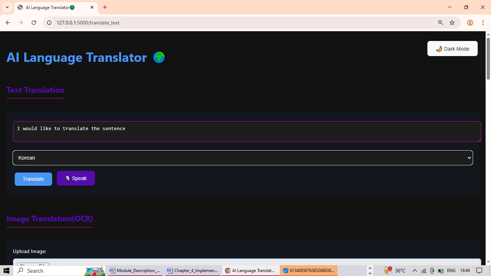
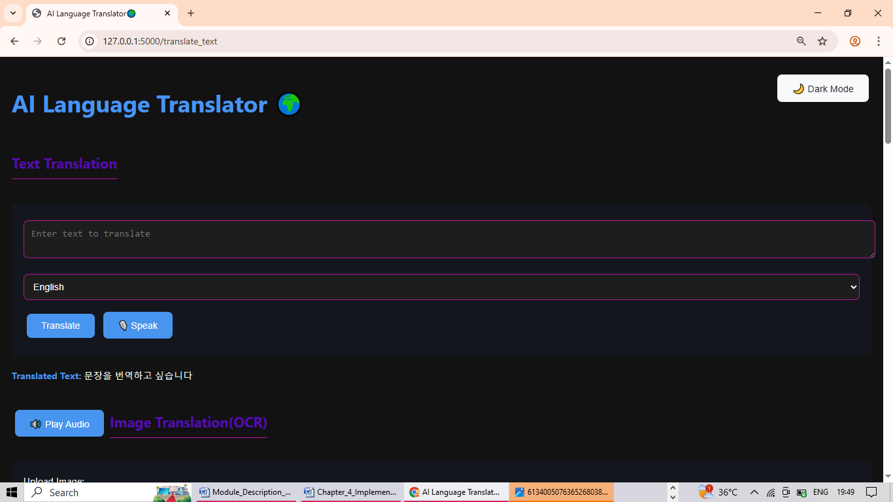

### Image Translation
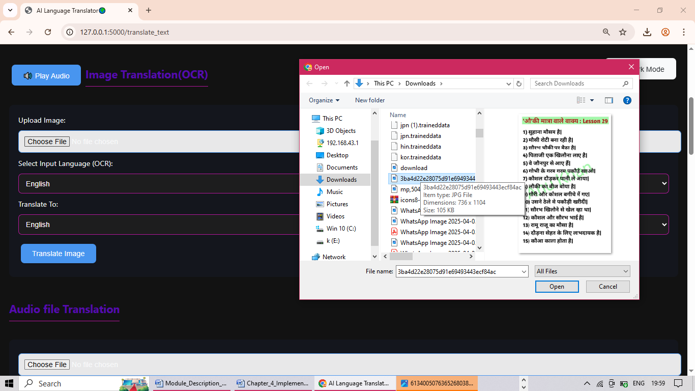
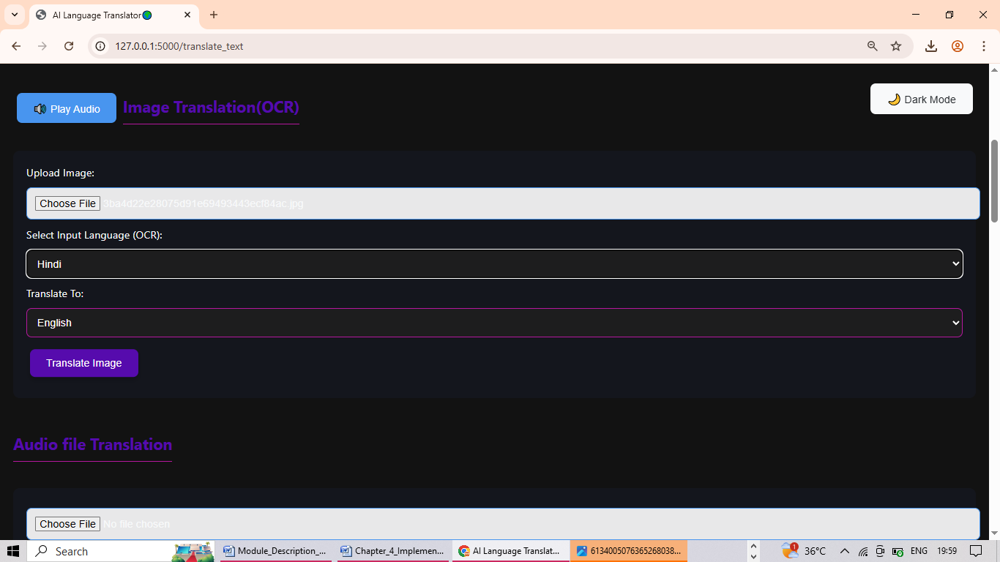
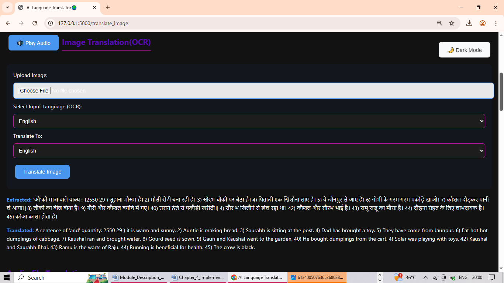

### Audio Translation
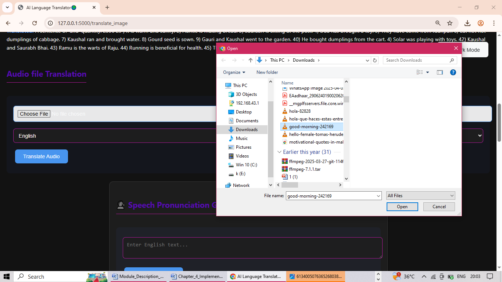
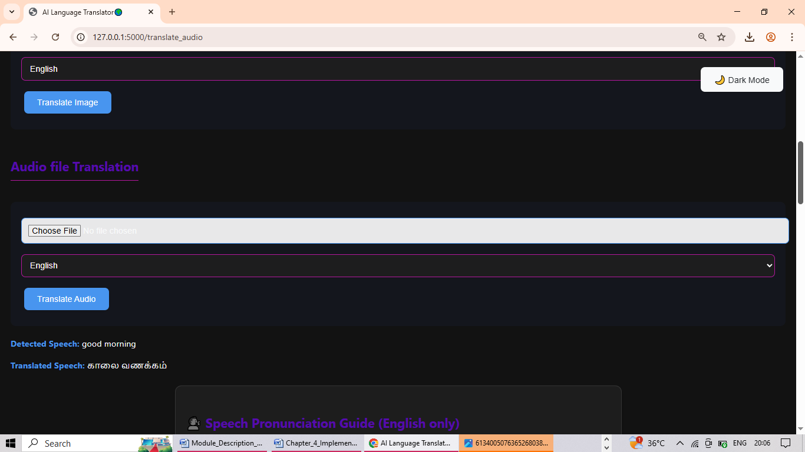

### Grammar Check

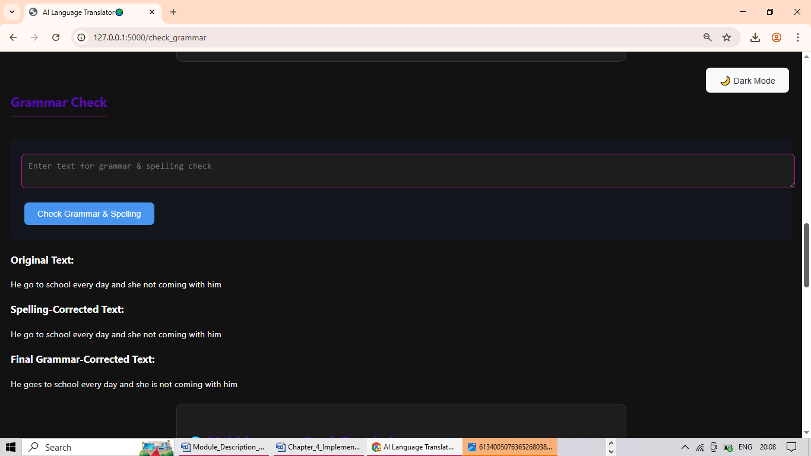

### Text file Translation
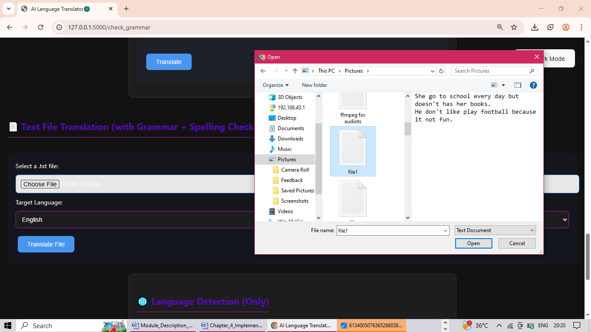
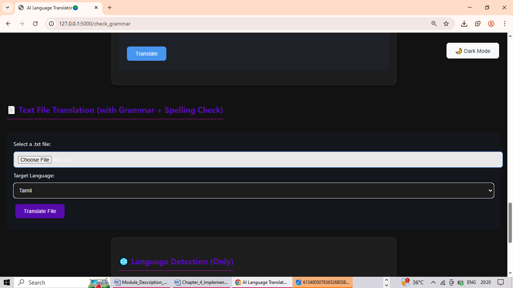
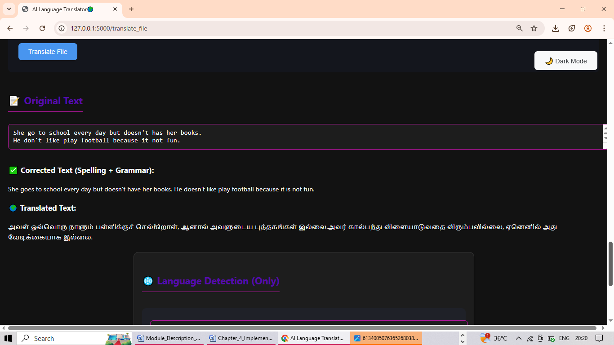

### Pronunciation Guide
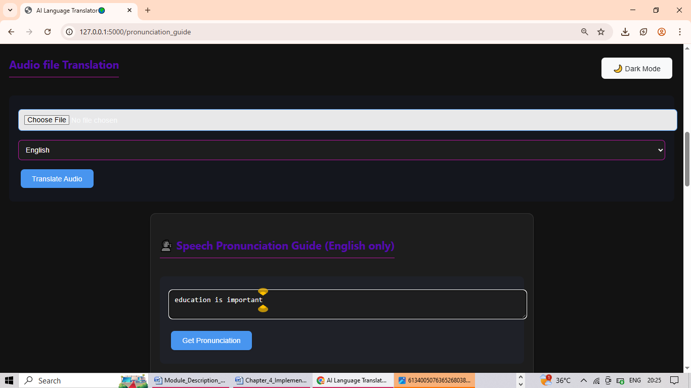
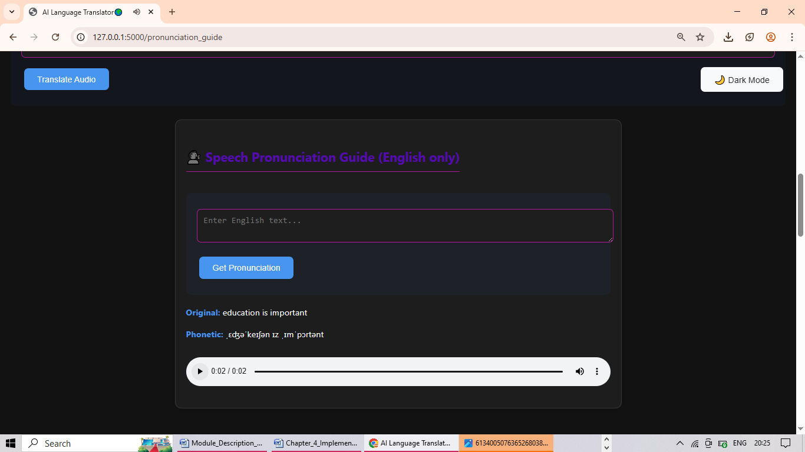

### Multi-Batch Translation
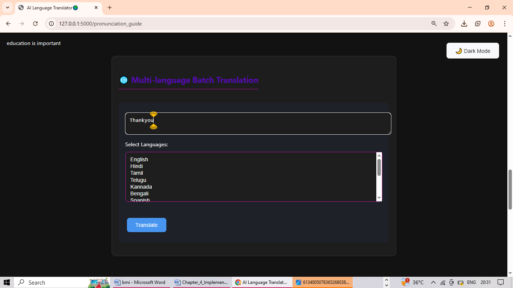
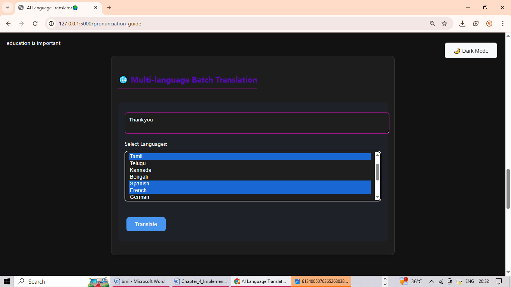
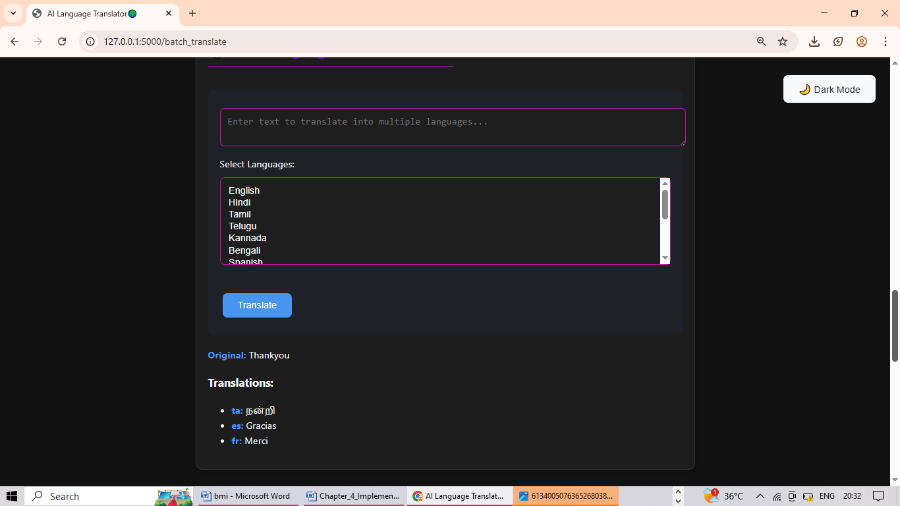

### Language Detection

### Translation History
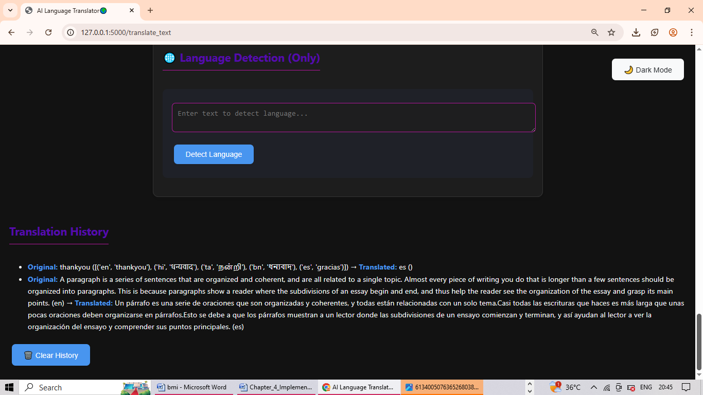

## 🚀 FUTURE ENHANCEMENTS

-  Real-time voice translation for multilingual conversations.

-  Offline translation support using lightweight AI models.

-  Context-aware and domain-specific translation improvements and Mobile application development for broader accessibility.

- Enhanced grammar feedback with detailed suggestions.

